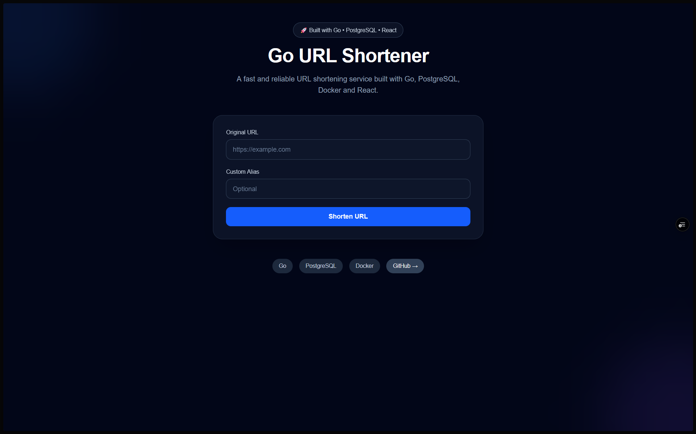
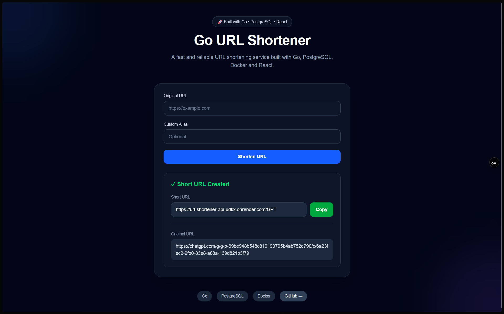

# 🚀 Go URL Shortener

A production-ready URL shortening service built with **Go**, **PostgreSQL**, **React**, and **Docker**. Users can generate unique short links, create custom aliases, and instantly redirect to the original URL through a clean REST API.

**🔗 Live Demo:** https://url-shortner-pink-phi.vercel.app

**⚙️ Backend API:** https://url-shortener-api-udkx.onrender.com

---

## 📸 Preview

### Home



### Shortened URL



---

## ✨ Features

- 🔗 Shorten long URLs instantly
- ✏️ Create custom aliases
- 🎲 Automatic unique short code generation
- 🚀 Fast HTTP redirects
- 📊 Track click count
- 🗄️ PostgreSQL database
- 🐳 Docker support for local development
- 🌐 Production deployment with Render, Vercel & Neon
- ⚡ RESTful API
- 🎨 Responsive React frontend built with Tailwind CSS

---

# 🛠 Tech Stack

## Backend

- Go
- PostgreSQL
- pgx
- Standard net/http package
- Repository Pattern
- Service Layer Architecture

## Frontend

- React
- TypeScript
- Vite
- Tailwind CSS

## Database

- PostgreSQL
- Neon

## Deployment

- Render (Backend)
- Vercel (Frontend)

## Development

- Docker
- Docker Compose

---

# 🏗️ Project Architecture

```
                   React Frontend
                          │
                          │ HTTP
                          ▼
                 Go REST API (net/http)
                          │
                 Service Layer
                          │
                Repository Layer
                          │
                    PostgreSQL
```

The backend follows a layered architecture to keep business logic separate from HTTP handlers and database operations.

```
Handler
   │
Service
   │
Repository
   │
Database
```

---

# 📂 Project Structure

```
url-shortner
│
├── cmd/
│   └── server/
│
├── internal/
│   ├── database/
│   ├── handlers/
│   ├── middleware/
│   ├── repository/
│   └── service/
│
├── migrations/
│
├── frontend/
│   ├── src/
│   ├── public/
│   └── package.json
│
├── Dockerfile
├── docker-compose.yml
├── go.mod
└── README.md
```

---

# 🚀 Running Locally

## Clone the repository

```bash
git clone https://github.com/shantam-sharma/url-shortner.git

cd url-shortner
```

---

## Backend

Create a `.env` file.

```env
DB_HOST=localhost
DB_PORT=5432
DB_USER=postgres
DB_PASSWORD=password
DB_NAME=url_shortener
DB_SSLMODE=disable

BASE_URL=http://localhost:8080
```

Start Docker containers.

```bash
docker compose up --build
```

Backend will run on

```
http://localhost:8080
```

---

## Frontend

Move into the frontend directory.

```bash
cd frontend
```

Install dependencies.

```bash
npm install
```

Create a `.env` file.

```env
VITE_API_URL=http://localhost:8080
```

Run the development server.

```bash
npm run dev
```

Frontend will run on

```
http://localhost:5173
```

---

# 🌐 Production Deployment

| Service | Platform |
|----------|----------|
| Frontend | Vercel |
| Backend | Render |
| Database | Neon PostgreSQL |

---

# 📡 API

## Create Short URL

**POST**

```
/api/v1/urls
```

### Request

```json
{
    "url": "https://google.com",
    "alias": "google"
}
```

### Successful Response

```json
{
    "short_url": "https://url-shortener-api-udkx.onrender.com/google",
    "original_url": "https://google.com",
    "short_code": "google"
}
```

---

## Redirect

```
GET /{shortCode}
```

Example

```
GET /google
```

Automatically redirects to

```
https://google.com
```

---

# ⚙️ Design Decisions

- Layered architecture (Handler → Service → Repository)
- PostgreSQL for persistent storage
- Environment-based configuration for local and production deployments
- CORS middleware for secure frontend communication
- Docker support for reproducible development environments
- Clean separation between frontend and backend services

---

# 🔮 Future Improvements

- User authentication (JWT)
- URL expiration
- QR code generation
- Analytics dashboard
- Rate limiting
- Redis caching
- Custom domains
- Admin dashboard
- Unit & integration tests

---

# 👨‍💻 Author

**Shantam Sharma**

GitHub: https://github.com/shantam-sharma

LinkedIn: *(Add your LinkedIn URL)*

---

# 📄 License

This project is licensed under the MIT License.
